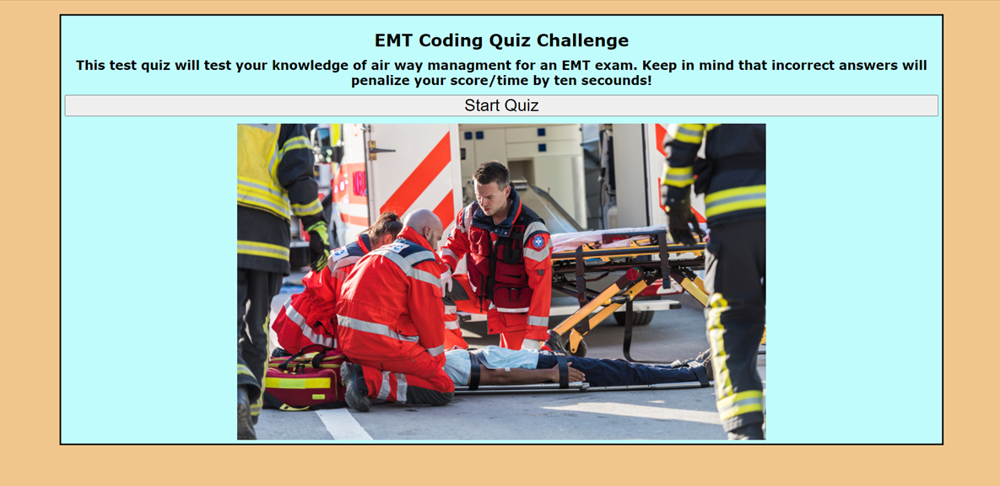
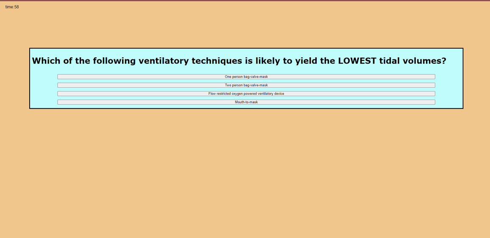
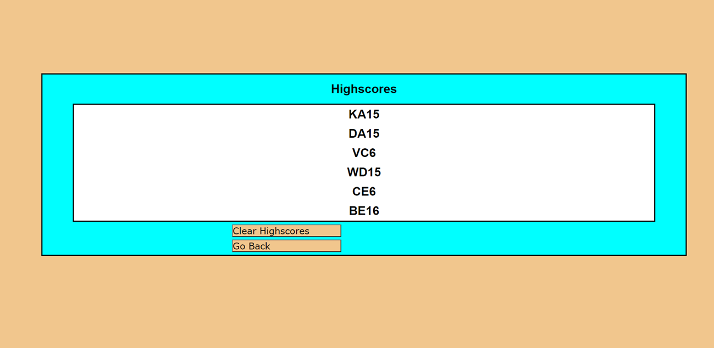

# EMT-Quiz
 

## Discription 
An app built for a timed EMT preparation Exam quiz with multiple-choice questions. This app will run in the browser and will feature dynamically updated HTML and CSS powered by JavaScript code. It has a clean, polished, and responsive user interface.

## Table of Content 

[Discription]()

[Deployed-Link]()

[Installing]()

[Usage]()

[Technologies]()

[Questions]()

[Acknowledgments]()

## Deployed-Link

https://kelebetengida.github.io/Code-Quiz/

##  Installing

To install and use this application, please clone the repo to your VS code. 

## Usage

## Technologies

HTML

CSS

JS

## Questions

GitHub: [github.com/kelebetengida]()

Email: [engidk@uw.edu]()

## Acknowledgments

Thankkyou to my instractors who have helped me through the learning curve of this project. 

